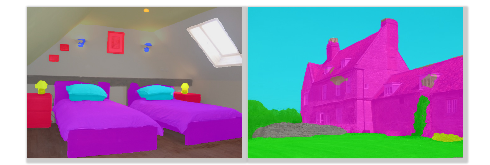

# <div align="center">SOTA Semantic Segmentation</div>


## <div align="center">Model Zoo</div>

[ddrnet]: https://arxiv.org/abs/2101.06085

[resnet]: https://arxiv.org/abs/1512.03385
[rest]: https://arxiv.org/abs/2105.13677v3
[pvtv2]: https://arxiv.org/abs/2106.13797
[segformer]: https://arxiv.org/abs/2105.15203v2
[volo]: https://arxiv.org/abs/2106.13112v1
[cyclemlp]: https://arxiv.org/abs/2107.10224

[upernet]: https://arxiv.org/abs/1807.10221
[fapn]: https://arxiv.org/abs/2108.07058

[maskformer]: https://arxiv.org/abs/2107.06278v1
[openworld]: https://arxiv.org/abs/2107.14228


[mit]: https://drive.google.com/drive/folders/1b7bwrInTW4VLEm27YawHOAMSMikga2Ia?usp=sharing
[segformerw]: https://drive.google.com/drive/folders/1GAku0G0iR9DsBxCbfENWMJ27c5lYUeQA?usp=sharing
[ddrnetw]: https://drive.google.com/drive/folders/15-rUFFwhKVra-6Y46HdcsfFCdOM4oEJA?usp=sharing
[ddrnetbw]: https://drive.google.com/drive/folders/15d-JHTt6k335ieHEMTGt1nWJHnxfP3LN?usp=sharing


Supported Backbones:
* *CNN*: [ResNet][resnet]
* *ViT*: [MiT][segformer], [PVTv2][pvtv2], [ResT][rest]
* *MLP*: [CycleMLP][cyclemlp]

Supported Heads:
* *CNN*: [UPerNet][upernet], [FaPN][fapn]
* *MLP*: [SegFormer][segformer]

Supported Standalone Models:
* *CNN*: [DDRNet][ddrnet]

<details open>
  <summary><strong>ADE20K</strong></summary>

Model | Backbone<br>Head | mIoU (%) | Params (M)<br>GFLOPs <small>(512x512)</small> | Weights
--- | --- | --- | --- | --- 
[SegFormer][segformer]<br>B0\|B1\|B2\|B3\|B4 | MiT<br>SegFormerHead | 38.0`\|`43.1`\|`47.5`\|`50.0`\|`51.1 | 4`\|`14`\|`28`\|`47`\|`64<br>8`\|`16`\|`62`\|`79`\|`96 | [models][segformerw]\|[backbones][mit]
[VOLO][volo]<br>D1\|D3\|D5 | VOLO<br>UperNet | 50.5`\|`52.9`\|`54.3 | - | N/A

</details>

<details open>
  <summary><strong>CityScapes</strong></summary>

Model<br><sup>(Image Size) | Backbone<br>Head | mIoU (%)<br><sup>(val/test) | Params (M)<br>GFLOPs | Weights
--- | --- | --- | --- | --- 
[SegFormer][segformer]<br>B0\|B1\|B2\|B3\|B4<br>(1024x1024) | MiT<br>SegFormerHead | 78.1`\|`80.0`\|`82.2`\|`83.3`\|`83.9<br>- | 4`\|`14`\|`28`\|`47`\|`64 <br> 126`\|`244`\|`717`\|`963`\|`1241 | [models][segformerw]\|[backbones][mit]
[DDRNet][ddrnet]<br>23slim\|23<br>(1024x2048) | DDRNet | 77.8`\|`79.5<br>77.4`\|`79.4 | 6`\|`20 <br> 36`\|`143 | [models][ddrnetw]\|[backbones][ddrnetbw]
[FaPN][fapn]<br>R18<br>(768x1536) | ResNet | 75.6<br>- | - | - | N/A

</details>

<details open>
  <summary><strong>CamVid</strong></summary>

Model | Backbone<br>Head | mIoU (%)<br><sup>(val/test) | Params (M) | Weights
--- | --- | --- | --- | --- 
[DDRNet][ddrnet]<br>23slim\|23 | DDRNet | -<br>74.4`\|`76.3 | 6`\|`20 | N/A

</details>

<details open>
  <summary><strong>COCO-Stuff-full</strong></summary>

Model | Backbone<br>Head  | mIoU <br><sup>(%) | Params <br><sup>(M) | Weights
--- | --- | --- | --- | --- 
[SegFormer][segformer]<br>B5 | MiT<br>SegFormerHead | 46.7 | 85 | N/A

</details>

<!---
<details>
  <summary><strong>Panoptic Segmentation on COCO panoptic-val</strong> (click to expand)</summary>

Method | Backbone | PQ | PQ<sup>Th | PQ<sup>St | SQ | RQ | Params <br><sup>(M) | GFLOPs | Pretrained
--- | --- | --- | --- | --- | --- | --- | --- | --- | ---
[MaskFormer][maskformer] | Swin-T | 47.7 | 51.7 | 41.7 | 80.4 | 58.3 | 42 | 179 | N/A
| | Swin-S | 49.7 | 54.4 | 42.6 | 80.9 | 60.4 | 63 | 259 | N/A
| | Swin-B | 51.8 | 56.3 | 43.2 | 81.4 | 61.8 | 102 | 411 | N/A

</details>

<details>
  <summary><strong>Entity Segmentation on COCO-val</strong> (click to expand)</summary>

Method | Backbone | Entity AP | Mask Rescore | Pretrained
--- | --- | --- | --- | ---
[Open-World Entity][openworld] | MiT-B0 | 28.8 | 30.4 | N/A
| | MiT-B2 | 35.1 | 36.6 | N/A
| | MiT-B3 | 36.9 | 38.5 | N/A
| | MiT-B5 | 37.2 | 38.7 | N/A


</details>

--->

## <div align="center">Supported Datasets</div>

[ade20k]: http://sceneparsing.csail.mit.edu/
[cityscapes]: https://www.cityscapes-dataset.com/
[camvid]: http://mi.eng.cam.ac.uk/research/projects/VideoRec/CamVid/
[cocostuff]: https://github.com/nightrome/cocostuff
[mhp]: https://lv-mhp.github.io/
[lip]: http://sysu-hcp.net/lip/index.php
[atr]: https://github.com/lemondan/HumanParsing-Dataset
[pascalcontext]: https://cs.stanford.edu/~roozbeh/pascal-context/
[pcannos]: https://drive.google.com/file/d/1hOQnuTVYE9s7iRdo-6iARWkN2-qCAoVz/view?usp=sharing
[suim]: http://irvlab.cs.umn.edu/resources/suim-dataset
[mv]: https://www.mapillary.com/dataset/vistas
[apolloscape]: http://apolloscape.auto/scene.html
[sunrgbd]: https://rgbd.cs.princeton.edu/

Dataset | Type | Categories | Train <br><sup>Images | Val<br><sup>Images | Test<br><sup>Images | Image Size<br><sup>(HxW)
--- | --- | --- | --- | --- | --- | ---
[COCO-Stuff][cocostuff] | General Scene Parsing | 171 | 118,000 | 5,000 | 20,000 | -
[ADE20K][ade20k] | General Scene Parsing | 150 | 20,210 | 2,000 | 3,352 | -
[PASCALContext][pascalcontext] | General Scene Parsing | 59 | 4,996 | 5,104 | 9,637 | -
||
[SUN RGB-D][sunrgbd]^ | Indoor Scene Parsing | - | 10,335 | - | - | -
||
[Mapillary Vistas][mv]^ | Street Scene Parsing | 124 | 18,000 | 2,000 | 5,000 | 1080x1920
[ApolloScape][apolloscape]^ | Street Scene Parsing | 22 | 146,997 | - | - | -
[CityScapes][cityscapes] | Street Scene Parsing | 19 | 2,975 | 500 | 1,525<sup>+labels | 1024x2048
[CamVid][camvid] | Street Scene Parsing | 11 | 367 | 101 | 233<sup>+labels | 720x960
||
[MHPv2][mhp] | Multi-Human Parsing | 58+1 | 15,403 | 5,000 | 5,000 | -
[MHPv1][mhp] | Multi-Human Parsing | 18+1 | 3,000 | 1,000 | 980<sup>+labels | -
[LIP][lip] | Multi-Human Parsing | 19+1 | 30,462 | 10,000 | - | -
[CIHP][lip] | Multi-Human Parsing | 19+1 | 28,280 | 5,000 | - | -
[ATR][atr] | Single-Human Parsing | 17+1 | 16,000 | 700 | 1,000<sup>+labels | -
||
[SUIM][suim] | Underwater Imagery | 8 | 1,525 | - | 110<sup>+labels | -

> Note: `+1` means '+background class'. `^` means coming soon.

Check [DATASETS](./DATASETS.md) to find more segmentation datasets.

<details>
  <summary><strong>Datasets Structure</strong> (click to expand)</summary>

Datasets should have the following structure:

```
data
|__ ADEChallenge
    |__ ADEChallengeData2016
        |__ images
            |__ training
            |__ validation
        |__ annotations
            |__ training
            |__ validation

|__ CityScapes
    |__ leftImg8bit
        |__ train
        |__ val
        |__ test
    |__ gtFine
        |__ train
        |__ val
        |__ test

|__ CamVid
    |__ train
    |__ val
    |__ test
    |__ train_labels
    |__ val_labels
    |__ test_labels
    
|__ VOCdevkit
    |__ VOC2010
        |__ JPEGImages
        |__ SegmentationClassContext
        |__ ImageSets
            |__ SegmentationContext
                |__ train.txt
                |__ val.txt
    
|__ COCO
    |__ images
        |__ train2017
        |__ val2017
    |__ labels
        |__ train2017
        |__ val2017

|__ MHPv1
    |__ images
    |__ annotations
    |__ train_list.txt
    |__ test_list.txt

|__ MHPv2
    |__ train
        |__ images
        |__ parsing_annos
    |__ val
        |__ images
        |__ parsing_annos

|__ LIP
    |__ LIP
        |__ TrainVal_images
            |__ train_images
            |__ val_images
        |__ TrainVal_parsing_annotations
            |__ train_segmentations
            |__ val_segmentations

    |__ CIHP
        |__ instance-leve_human_parsing
            |__ train
                |__ Images
                |__ Category_ids
            |__ val
                |__ Images
                |__ Category_ids

    |__ ATR
        |__ humanparsing
            |__ JPEGImages
            |__ SegmentationClassAug

|__ SUIM
    |__ train_val
        |__ images
        |__ masks
    |__ TEST
        |__ images
        |__ masks
```

> Note: For PASCALContext, download the annotations from [here](pcannos) and put it in VOC2010.

</details>

## <div align="center">Usage</div>

<details>
  <summary><strong>Requirements</strong> (click to expand)</summary>

* python >= 3.6
* torch >= 1.8.1
* torchvision >= 0.9.1

Other requirements can be installed with `pip install -r requirements.txt`.

</details>

<br>
<details>
  <summary><strong>Configuration</strong> (click to expand)</summary>

Create a configuration file in `configs`. Sample configuration for ADE20K dataset can be found [here](configs/ade20k.yaml). Then edit the fields you think if it is needed. This configuration file is needed for all of training, evaluation and prediction scripts.

</details>

<br>
<details>
  <summary><strong>Training</strong> (click to expand)</summary>

To train with a single GPU:

```bash
$ python tools/train.py --cfg configs/CONFIG_FILE.yaml
```

To train with multiple gpus, set `DDP` field in config file to `true` and run as follows:

```bash
$ python -m torch.distributed.launch --nproc_per_node=2 --use_env tools/train.py --cfg configs/CONFIG_FILE.yaml
```

</details>

<br>
<details>
  <summary><strong>Evaluation</strong> (click to expand)</summary>

Make sure to set `MODEL_PATH` of the configuration file to your trained model directory.

```bash
$ python tools/val.py --cfg configs/CONFIG_FILE.yaml
```

To evaluate with multi-scale and flip, change `ENABLE` field in `MSF` to `true` and run the same command as above.

</details>

<br>
<details open>
  <summary><strong>Inference</strong></summary>

Make sure to set `MODEL_PATH` of the configuration file to model's weights.

```bash
$ python tools/infer.py --cfg configs/CONFIG_FILE.yaml
```

Example test results:



</details>

<details>
  <summary><strong>References</strong> (click to expand)</summary>

* https://github.com/CoinCheung/BiSeNet
* https://github.com/open-mmlab/mmsegmentation
* https://github.com/rwightman/pytorch-image-models

</details>

<details>
  <summary><strong>Citations</strong> (click to expand)</summary>

```
@article{xie2021segformer,
  title={SegFormer: Simple and Efficient Design for Semantic Segmentation with Transformers},
  author={Xie, Enze and Wang, Wenhai and Yu, Zhiding and Anandkumar, Anima and Alvarez, Jose M and Luo, Ping},
  journal={arXiv preprint arXiv:2105.15203},
  year={2021}
}

@misc{xiao2018unified,
  title={Unified Perceptual Parsing for Scene Understanding}, 
  author={Tete Xiao and Yingcheng Liu and Bolei Zhou and Yuning Jiang and Jian Sun},
  year={2018},
  eprint={1807.10221},
  archivePrefix={arXiv},
  primaryClass={cs.CV}
}

@article{hong2021deep,
  title={Deep Dual-resolution Networks for Real-time and Accurate Semantic Segmentation of Road Scenes},
  author={Hong, Yuanduo and Pan, Huihui and Sun, Weichao and Jia, Yisong},
  journal={arXiv preprint arXiv:2101.06085},
  year={2021}
}

@misc{zhang2021rest,
  title={ResT: An Efficient Transformer for Visual Recognition}, 
  author={Qinglong Zhang and Yubin Yang},
  year={2021},
  eprint={2105.13677},
  archivePrefix={arXiv},
  primaryClass={cs.CV}
}

@misc{huang2021fapn,
  title={FaPN: Feature-aligned Pyramid Network for Dense Image Prediction}, 
  author={Shihua Huang and Zhichao Lu and Ran Cheng and Cheng He},
  year={2021},
  eprint={2108.07058},
  archivePrefix={arXiv},
  primaryClass={cs.CV}
}

@misc{chen2021cyclemlp,
  title={CycleMLP: A MLP-like Architecture for Dense Prediction}, 
  author={Shoufa Chen and Enze Xie and Chongjian Ge and Ding Liang and Ping Luo},
  year={2021},
  eprint={2107.10224},
  archivePrefix={arXiv},
  primaryClass={cs.CV}
}

@misc{wang2021pvtv2,
  title={PVTv2: Improved Baselines with Pyramid Vision Transformer}, 
  author={Wenhai Wang and Enze Xie and Xiang Li and Deng-Ping Fan and Kaitao Song and Ding Liang and Tong Lu and Ping Luo and Ling Shao},
  year={2021},
  eprint={2106.13797},
  archivePrefix={arXiv},
  primaryClass={cs.CV}
}

```

</details>