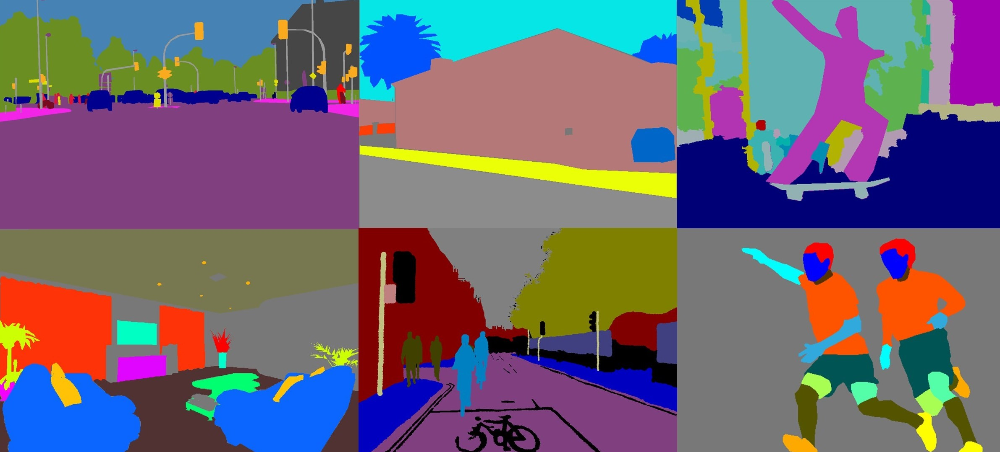
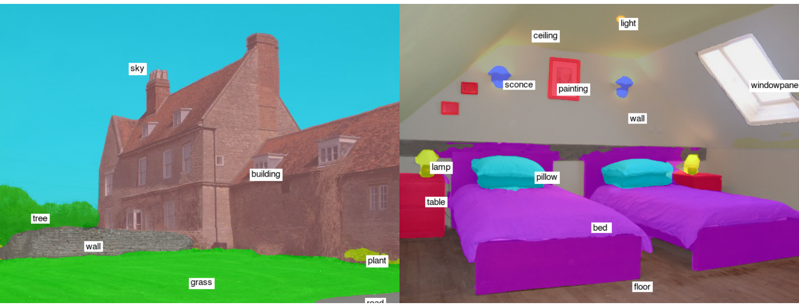

# <div align="center">Semantic Segmentation</div>

<div align="center">
<p>Easy to use and customizable SOTA Semantic Segmentation models with abundant datasets in PyTorch</p>

<a href="https://colab.research.google.com/github/sithu31296/semantic-segmentation/blob/main/notebooks/tutorial.ipynb"></a>
</div>



## <div align="center">Major Rework! Stay tuned...</div>

<p>A lot has been changed since 2022, nowadays there are even open-world segmentation models (Segment Anything). However, traditional segmentation models are still in demand for high accuracy and custom use cases. This repo will be updated according to new PyTorch version, updated models, and documentations for how to use with a custom dataset, etc.</p>
<p>Expected release date -> May 2024</p>

Planned features:
* Rework on whole training pipeline
* Baseline pre-trained model
* New updated ideas
* Easy integration with SOTA backbone models (with tutorials)
* Tutorial for custom dataset
* Distributed training

Current features to be discarded:
* Amount of datasets provided will be reduced. But instead, representative ones will be remained with a tutorial for custom dataset.
* Amount of models provided will be reducted. Instead, valuable tricks and modules will be remained, and can be easily integrated with any models.
* Augmentations will be replaced with official torchvisionv2 transforms.
* Conversion and inference with other frameworks

</div>

## <div align="center">Features</div>

* Applicable to following tasks:
  * Scene Parsing
  * Human Parsing
  * Face Parsing
  * Medical Image Segmentation (Coming Soon)
* 20+ Datasets
* 15+ SOTA Backbones
* 10+ SOTA Semantic Segmentation Models
* PyTorch, ONNX, TFLite, OpenVINO Export & Inference 

</div>


## <div align="center">Model Zoo</div>

Supported Backbones:
* [ResNet](https://arxiv.org/abs/1512.03385) (CVPR 2016)
* [ResNetD](https://arxiv.org/abs/1812.01187) (ArXiv 2018)
* [MobileNetV2](https://arxiv.org/abs/1801.04381) (CVPR 2018)
* [MobileNetV3](https://arxiv.org/abs/1905.02244) (ICCV 2019)
* [MiT](https://arxiv.org/abs/2105.15203v2) (NeurIPS 2021)
* [ResT](https://arxiv.org/abs/2105.13677v3) (NeurIPS 2021)
* [MicroNet](https://arxiv.org/abs/2108.05894) (ICCV 2021)
* [ResNet+](https://arxiv.org/abs/2110.00476) (ArXiv 2021)
* [PVTv2](https://arxiv.org/abs/2106.13797) (CVMJ 2022)
* [PoolFormer](https://arxiv.org/abs/2111.11418) (CVPR 2022)
* [ConvNeXt](https://arxiv.org/abs/2201.03545) (CVPR 2022)
* [UniFormer](https://arxiv.org/abs/2201.09450) (ArXiv 2022)
* [VAN](https://arxiv.org/abs/2202.09741) (ArXiv 2022)
* [DaViT](https://arxiv.org/abs/2204.03645) (ArXiv 2022)

Supported Heads/Methods:
* [FCN](https://arxiv.org/abs/1411.4038) (CVPR 2015)
* [UPerNet](https://arxiv.org/abs/1807.10221) (ECCV 2018)
* [BiSeNetv1](https://arxiv.org/abs/1808.00897) (ECCV 2018)
* [FPN](https://arxiv.org/abs/1901.02446) (CVPR 2019)
* [SFNet](https://arxiv.org/abs/2002.10120) (ECCV 2020)
* [SegFormer](https://arxiv.org/abs/2105.15203v2) (NeurIPS 2021)
* [FaPN](https://arxiv.org/abs/2108.07058) (ICCV 2021)
* [CondNet](https://arxiv.org/abs/2109.10322) (IEEE SPL 2021)
* [Light-Ham](https://openreview.net/forum?id=1FvkSpWosOl) (ICLR 2021)
* [Lawin](https://arxiv.org/abs/2201.01615) (ArXiv 2022)
* [TopFormer](https://arxiv.org/abs/2204.05525) (CVPR 2022)

Supported Standalone Models:
* [BiSeNetv2](https://arxiv.org/abs/2004.02147v1) (IJCV 2021)
* [DDRNet](https://arxiv.org/abs/2101.06085) (ArXiv 2021)

Supported Modules:
* [PPM](https://arxiv.org/abs/1612.01105) (CVPR 2017)
* [PSA](https://arxiv.org/abs/2107.00782) (ArXiv 2021)

Refer to [MODELS](./docs/MODELS.md) for benchmarks and available pre-trained models.

And check [BACKBONES](./docs/BACKBONES.md) for supported backbones.

> Notes: Most of the methods do not have pre-trained models. It's very difficult to combine different models with pre-trained weights in one repository and limited resource to re-train myself.

## <div align="center">Supported Datasets</div>

Scene Parsing:
* [ADE20K](http://sceneparsing.csail.mit.edu/)
* [CityScapes](https://www.cityscapes-dataset.com/)
* [COCO-Stuff](https://github.com/nightrome/cocostuff)
* [CamVid](http://mi.eng.cam.ac.uk/research/projects/VideoRec/CamVid/)
* [PASCAL-Context](https://cs.stanford.edu/~roozbeh/pascal-context/)
* [Mapillary Vistas](https://www.mapillary.com/dataset/vistas)
* [Sun RGB-D](https://rgbd.cs.princeton.edu/)

Human Parsing:
* [MHPv2](https://lv-mhp.github.io/)
* [MHPv1](https://lv-mhp.github.io/)
* [LIP](http://sysu-hcp.net/lip/index.php)
* [CCIHP](https://kalisteo.cea.fr/wp-content/uploads/2021/09/README.html)
* [CIHP](http://sysu-hcp.net/lip/index.php)
* [ATR](https://github.com/lemondan/HumanParsing-Dataset)

Face Parsing:
* [HELEN](https://www.sifeiliu.net/face-parsing)
* [LaPa](https://github.com/JDAI-CV/lapa-dataset)
* [iBugMask](https://github.com/hhj1897/face_parsing)
* [CelebAMaskHQ](https://github.com/switchablenorms/CelebAMask-HQ)
* [FaceSynthetics](https://github.com/microsoft/FaceSynthetics)

Others:
* [SUIM](http://irvlab.cs.umn.edu/resources/suim-dataset)

Refer to [DATASETS](./docs/DATASETS.md) for more details and dataset preparation.

<details>
  <summary><strong>Available Augmentations</strong> (click to expand)</summary>

Check the notebook [here](./notebooks/aug_test.ipynb) to test the augmentation effects.

Pixel-level Transforms:
* ColorJitter (Brightness, Contrast, Saturation, Hue)
* Gamma, Sharpness, AutoContrast, Equalize, Posterize
* GaussianBlur, Grayscale

Spatial-level Transforms:
* Affine, RandomRotation
* HorizontalFlip, VerticalFlip
* CenterCrop, RandomCrop
* Pad, ResizePad, Resize
* RandomResizedCrop

</details>

## <div align="center">Usage</div>

<details open>
  <summary><strong>Installation</strong></summary>

* python >= 3.6
* torch >= 1.8.1
* torchvision >= 0.9.1

Then, clone the repo and install the project with:

```bash
$ git clone https://github.com/sithu31296/semantic-segmentation
$ cd semantic-segmentation
$ pip install -e .
```

</details>

<br>
<details>
  <summary><strong>Configuration</strong> (click to expand)</summary>

Create a configuration file in `configs`. Sample configuration for ADE20K dataset can be found [here](configs/ade20k.yaml). Then edit the fields you think if it is needed. This configuration file is needed for all of training, evaluation and prediction scripts.

</details>

<br>
<details>
  <summary><strong>Training</strong> (click to expand)</summary>

To train with a single GPU:

```bash
$ python tools/train.py --cfg configs/CONFIG_FILE.yaml
```

To train with multiple gpus, set `DDP` field in config file to `true` and run as follows:

```bash
$ python -m torch.distributed.launch --nproc_per_node=2 --use_env tools/train.py --cfg configs/<CONFIG_FILE_NAME>.yaml
```

</details>

<br>
<details>
  <summary><strong>Evaluation</strong> (click to expand)</summary>

Make sure to set `MODEL_PATH` of the configuration file to your trained model directory.

```bash
$ python tools/val.py --cfg configs/<CONFIG_FILE_NAME>.yaml
```

To evaluate with multi-scale and flip, change `ENABLE` field in `MSF` to `true` and run the same command as above.

</details>

<br>
<details open>
  <summary><strong>Inference</strong></summary>

To make an inference, edit the parameters of the config file from below.
* Change `MODEL` >> `NAME` and `BACKBONE` to your desired pretrained model.
* Change `DATASET` >> `NAME` to the dataset name depending on the pretrained model.
* Set `TEST` >> `MODEL_PATH` to pretrained weights of the testing model.
* Change `TEST` >> `FILE` to the file or image folder path you want to test.
* Testing results will be saved in `SAVE_DIR`.

```bash
## example using ade20k pretrained models
$ python tools/infer.py --cfg configs/ade20k.yaml
```

Example test results (SegFormer-B2):



</details>

<br>
<details>
  <summary><strong>Convert to other Frameworks</strong> (ONNX, CoreML, OpenVINO, TFLite)</summary>

To convert to ONNX and CoreML, run:

```bash
$ python tools/export.py --cfg configs/<CONFIG_FILE_NAME>.yaml
```

To convert to OpenVINO and TFLite, see [torch_optimize](https://github.com/sithu31296/torch_optimize).

</details>

<br>
<details>
  <summary><strong>Inference</strong> (ONNX, OpenVINO, TFLite)</summary>

```bash
## ONNX Inference
$ python scripts/onnx_infer.py --model <ONNX_MODEL_PATH> --img-path <TEST_IMAGE_PATH>

## OpenVINO Inference
$ python scripts/openvino_infer.py --model <OpenVINO_MODEL_PATH> --img-path <TEST_IMAGE_PATH>

## TFLite Inference
$ python scripts/tflite_infer.py --model <TFLite_MODEL_PATH> --img-path <TEST_IMAGE_PATH>
```

</details>

<br>
<details>
  <summary><strong>References</strong> (click to expand)</summary>

* https://github.com/CoinCheung/BiSeNet
* https://github.com/open-mmlab/mmsegmentation
* https://github.com/rwightman/pytorch-image-models

</details>

<br>
<details>
  <summary><strong>Citations</strong> (click to expand)</summary>

```
@article{xie2021segformer,
  title={SegFormer: Simple and Efficient Design for Semantic Segmentation with Transformers},
  author={Xie, Enze and Wang, Wenhai and Yu, Zhiding and Anandkumar, Anima and Alvarez, Jose M and Luo, Ping},
  journal={arXiv preprint arXiv:2105.15203},
  year={2021}
}

@misc{xiao2018unified,
  title={Unified Perceptual Parsing for Scene Understanding}, 
  author={Tete Xiao and Yingcheng Liu and Bolei Zhou and Yuning Jiang and Jian Sun},
  year={2018},
  eprint={1807.10221},
  archivePrefix={arXiv},
  primaryClass={cs.CV}
}

@article{hong2021deep,
  title={Deep Dual-resolution Networks for Real-time and Accurate Semantic Segmentation of Road Scenes},
  author={Hong, Yuanduo and Pan, Huihui and Sun, Weichao and Jia, Yisong},
  journal={arXiv preprint arXiv:2101.06085},
  year={2021}
}

@misc{zhang2021rest,
  title={ResT: An Efficient Transformer for Visual Recognition}, 
  author={Qinglong Zhang and Yubin Yang},
  year={2021},
  eprint={2105.13677},
  archivePrefix={arXiv},
  primaryClass={cs.CV}
}

@misc{huang2021fapn,
  title={FaPN: Feature-aligned Pyramid Network for Dense Image Prediction}, 
  author={Shihua Huang and Zhichao Lu and Ran Cheng and Cheng He},
  year={2021},
  eprint={2108.07058},
  archivePrefix={arXiv},
  primaryClass={cs.CV}
}

@misc{wang2021pvtv2,
  title={PVTv2: Improved Baselines with Pyramid Vision Transformer}, 
  author={Wenhai Wang and Enze Xie and Xiang Li and Deng-Ping Fan and Kaitao Song and Ding Liang and Tong Lu and Ping Luo and Ling Shao},
  year={2021},
  eprint={2106.13797},
  archivePrefix={arXiv},
  primaryClass={cs.CV}
}

@article{Liu2021PSA,
  title={Polarized Self-Attention: Towards High-quality Pixel-wise Regression},
  author={Huajun Liu and Fuqiang Liu and Xinyi Fan and Dong Huang},
  journal={Arxiv Pre-Print arXiv:2107.00782 },
  year={2021}
}

@misc{chao2019hardnet,
  title={HarDNet: A Low Memory Traffic Network}, 
  author={Ping Chao and Chao-Yang Kao and Yu-Shan Ruan and Chien-Hsiang Huang and Youn-Long Lin},
  year={2019},
  eprint={1909.00948},
  archivePrefix={arXiv},
  primaryClass={cs.CV}
}

@inproceedings{sfnet,
  title={Semantic Flow for Fast and Accurate Scene Parsing},
  author={Li, Xiangtai and You, Ansheng and Zhu, Zhen and Zhao, Houlong and Yang, Maoke and Yang, Kuiyuan and Tong, Yunhai},
  booktitle={ECCV},
  year={2020}
}

@article{Li2020SRNet,
  title={Towards Efficient Scene Understanding via Squeeze Reasoning},
  author={Xiangtai Li and Xia Li and Ansheng You and Li Zhang and Guang-Liang Cheng and Kuiyuan Yang and Y. Tong and Zhouchen Lin},
  journal={ArXiv},
  year={2020},
  volume={abs/2011.03308}
}

@ARTICLE{Yucondnet21,
  author={Yu, Changqian and Shao, Yuanjie and Gao, Changxin and Sang, Nong},
  journal={IEEE Signal Processing Letters}, 
  title={CondNet: Conditional Classifier for Scene Segmentation}, 
  year={2021},
  volume={28},
  number={},
  pages={758-762},
  doi={10.1109/LSP.2021.3070472}
}

@misc{yan2022lawin,
  title={Lawin Transformer: Improving Semantic Segmentation Transformer with Multi-Scale Representations via Large Window Attention}, 
  author={Haotian Yan and Chuang Zhang and Ming Wu},
  year={2022},
  eprint={2201.01615},
  archivePrefix={arXiv},
  primaryClass={cs.CV}
}

@misc{yu2021metaformer,
  title={MetaFormer is Actually What You Need for Vision}, 
  author={Weihao Yu and Mi Luo and Pan Zhou and Chenyang Si and Yichen Zhou and Xinchao Wang and Jiashi Feng and Shuicheng Yan},
  year={2021},
  eprint={2111.11418},
  archivePrefix={arXiv},
  primaryClass={cs.CV}
}

@misc{wightman2021resnet,
  title={ResNet strikes back: An improved training procedure in timm}, 
  author={Ross Wightman and Hugo Touvron and Hervé Jégou},
  year={2021},
  eprint={2110.00476},
  archivePrefix={arXiv},
  primaryClass={cs.CV}
}

@misc{liu2022convnet,
  title={A ConvNet for the 2020s}, 
  author={Zhuang Liu and Hanzi Mao and Chao-Yuan Wu and Christoph Feichtenhofer and Trevor Darrell and Saining Xie},
  year={2022},
  eprint={2201.03545},
  archivePrefix={arXiv},
  primaryClass={cs.CV}
}

@misc{li2022uniformer,
  title={UniFormer: Unifying Convolution and Self-attention for Visual Recognition}, 
  author={Kunchang Li and Yali Wang and Junhao Zhang and Peng Gao and Guanglu Song and Yu Liu and Hongsheng Li and Yu Qiao},
  year={2022},
  eprint={2201.09450},
  archivePrefix={arXiv},
  primaryClass={cs.CV}
}

```

</details>